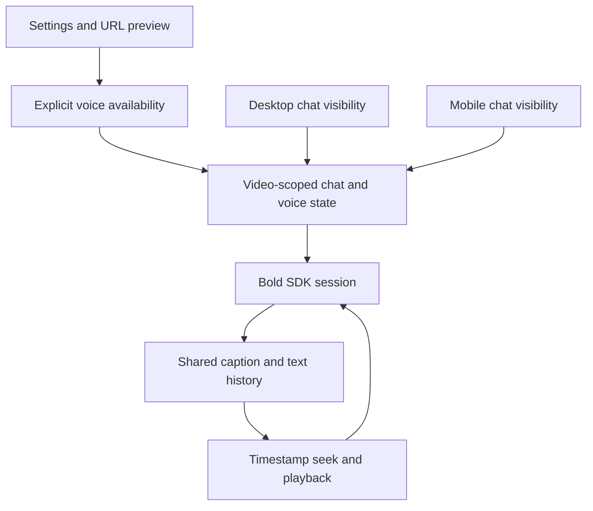
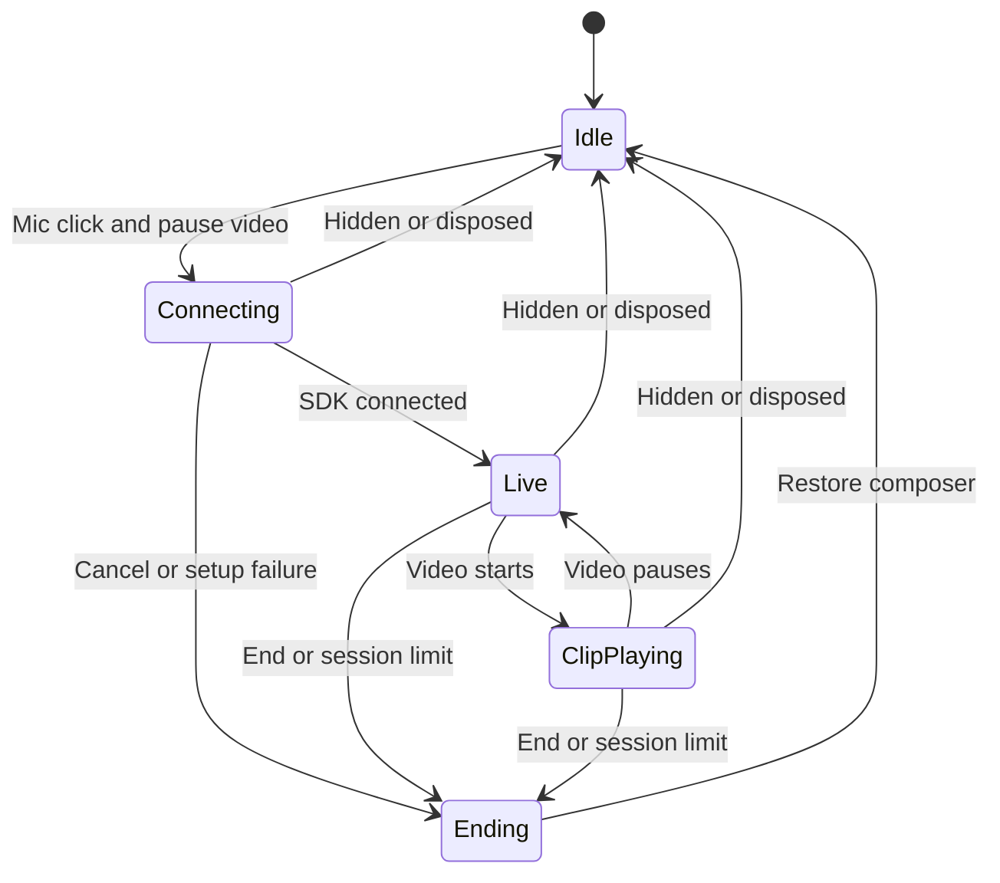

# Video Voice Chat - Plan

## Goal Capsule

- Objective: Viewers can talk about a video and play the moments mentioned in the answer.
- Means: Bold's browser voice session SDK, integrated into the existing video chat.
- Authority: The user's request and BOLD-1854/BOLD-1855; BOLD-1849's sampling decision supersedes the older long-video refusal requirement.
- Execution: Implement and verify in this starter, then open a PR with desktop and mobile screenshots. Preserve unrelated local files.
- Delivery: Companion SDK feature PR with a minor changeset, followed by the frontend PR. SDK versioning and publishing run through the repository's automated release PR workflow.

---

## Product Contract

### Summary

Add a microphone beside Send that opens an inline voice bar. Keep spoken captions in the text conversation, with seekable timestamps and accessible controls.

### Problem Frame

The voice broker and browser SDK have shipped, but portal viewers cannot use them. HRTU demonstrates the interaction, while this starter must support tenant themes, responsive chat surfaces, and backend feature gating.

### Requirements

**Availability**

- R1. Voice is hidden by default and visible only when AI is enabled and voice is explicitly enabled in settings, or the viewer opens the video page with `?voice=1`.
- R2. The URL override reveals UI only; the backend remains authoritative for feature flags, video access, transcript availability, and allowances.
- R3. Use the released Bold SDK for session creation, media transport, limits, captions, timestamps, and cleanup. Never add provider keys to the frontend.

**Conversation and playback**

- R4. Starting voice pauses the video and replaces the composer with a level-driven orb, status, microphone mute, and End controls.
- R5. Text and voice turns appear in one chronological thread and survive switching between desktop and mobile chat surfaces during the video visit.
- R6. Caption timestamps seek and play the video. While it plays, mute both microphone and assistant output and tell the session the playback position.
- R7. Retain the typed draft when entering voice and restore it on end. Disable text submission during a voice session and prevent duplicate paid sessions.
- R8. End and release media when the chat becomes hidden, the video changes, the page hides, or the component unmounts.

**Feedback and accessibility**

- R9. Show concise, recoverable feedback for missing transcript, disabled feature, exhausted allowance, competing session, rate limit, denied microphone, unsupported browser, connection failure, and session end reasons. Do not expose raw provider errors.
- R10. Preserve tenant themes, provide 44px touch controls and visible keyboard focus, move focus into the bar and back appropriately, keep a status live region mounted, and respect reduced motion.
- R11. Long videos remain eligible; the backend samples over-budget transcripts without a viewer warning.

### Acceptance Examples

- AE1. Covers R1/R2. Missing settings and no override produce the existing composer with no mic or voice request. `?voice=1` reveals the mic, while a backend refusal is shown as an unavailable message.
- AE2. Covers R4/R5/R7. Type a draft, start voice, receive overlapping caption updates, end voice, then submit the retained draft. The thread retains one stable entry per caption turn in chronological order.
- AE3. Covers R6. Select an assistant timestamp, including `0:00`; playback starts there with voice input/output muted. Pause the video and resume the existing conversation without overriding the viewer's manual mic mute.
- AE4. Covers R8. End during microphone permission or connection setup, hide chat, navigate to another video, and cross the mobile breakpoint. No hidden or stale session remains active.

### Scope Boundaries

The target is video-page chat on direct, slug, and playlist routes. Full-screen coach voice, embed voice, provider administration, and tenant rollout changes are separate work. Voice requires a native player with playback-state events; the current YouTube play-from-source shim has no state/events and retains text chat until that adapter is extended.

#### Deferred to Follow-Up Work

BOLD-1850 owns customer-facing voice configuration. The backend settings response also needs to expose the Mission Control flag before automatic visibility can work.

---

## Planning Contract

### Key Technical Decisions

- KTD1. Extend `@boldvideo/bold-js@1.27.0` with public playback coordination, then consume the release in the starter. Until publication, verify full playback against a locally packed SDK and retain an explicit release dependency on the frontend PR. Keep the published 1.27.0 dependency installable with a safe fallback that ends voice on clip playback; after publication update the dependency and lockfile to enable the continuous session. Do not publish or consume changesets locally.
- KTD2. Normalize a strictly boolean `account.voice.enabled` capability in `lib/portal-config.ts`, defaulting to false. This is a proposed backend seam, not an existing response field. Keep preview state scoped to the current URL and preserve it through canonical redirects.
- KTD3. Own voice lifecycle alongside shared chat state, scoped to the current video and tenant. SDK handles are single-use; reconnect creates a fresh handle. SDK callbacks from a disposed handle must not alter the next session.
- KTD4. Upsert SDK captions into shared messages using a session-qualified turn ID. Render escaped caption segments directly, using the SDK timestamp parser. Visual history continuity does not imply the backend shares text and voice model context.
- KTD5. Compute visibility of the active responsive chat surface before controlling the shared session. Both desktop and mobile chat currently remain mounted behind CSS; an inactive instance must not terminate its visible sibling's session. End when no chat surface is visible; keep the session when a breakpoint change transfers it to another visible chat surface.
- KTD6. Use the existing Bold client provider and player ref. Do not duplicate WebRTC or inspect SDK private audio/data-channel objects to implement R6.
- KTD7. Keep the current theme and component vocabulary. Physical scene: a learner watches a course on a laptop or phone and glances between the player and chat; the voice bar inherits their chosen light/dark tenant theme. Use restrained semantic color, stable status text with approximately 1.2-second speaking hysteresis, and transform-only audio motion.
- KTD8. Add `VoiceSession.setPlaybackState({ playing, currentTime })` to mute microphone and assistant output during clips and send timestamp context over the SDK-owned channel. Preserve manual mic mute independently. (session-settled: user-approved — chosen over ending voice on playback: keep the existing conversation through clips.) Apply the latest pre-live playback state when the session starts; playback activity may reset idle time but never the maximum duration.

### High-Level Technical Design

| AI | Voice settings | URL preview | Mic |
|---|---|---|---|
| Off | Any | Any | Hidden |
| On | Missing/false | Absent | Hidden |
| On | True | Absent | Visible |
| On | Missing/false | `1` | Visible, backend still decides |
| On | Any | `0` | Hidden |

### Assumptions

The settings capability will use the sibling shape `account.voice.enabled`, consistent with `account.multimodal.enabled`. The frontend PR documents this contract without changing the backend. No tenant flags are toggled as part of implementation.

---

## Implementation Units

### U1. Add explicit availability and SDK dependency

**Goal:** Enable opt-in preview without exposing voice by default. Covers R1/R2/R3/R11 and KTD1/KTD2.

**Files:** `package.json`, `bun.lock`, `lib/portal-config.ts`, `lib/video-voice.ts`, `tests/video-voice.test.ts`, `app/(default)/v/[id]/page.tsx`, `app/(default)/[id]/page.tsx`, `app/(default)/pl/[id]/v/[videoId]/page.tsx`, `README.md`.

**Dependencies:** U4 for full playback support; availability can be implemented independently.

**Approach:** Extend the existing normalization pattern with a typed optional capability. Carry preview through the existing video route resolution. Document the settings gap and secure-context requirement.

**Test scenarios:** Missing/null/malformed flag values stay off; exact true enables; AI off wins; exact `voice=1` opts in; `voice=0` hides; canonical redirects preserve voice and timestamp.

**Verification:** Focused tests and type checking pass; SDK exports resolve from the published package.

### U2. Integrate shared session and captions

**Goal:** Connect the existing chat history to a single SDK session. Covers R3/R5/R7/R8/R9 and KTD3/KTD4/KTD5/KTD6.

**Files:** `components/video/chat/voice-provider.tsx`, `lib/video-voice.ts`, `components/video/chat/types.ts`, `components/video/chat/use-ai-assistant.ts`, `tests/video-voice.test.ts`.

**Dependencies:** U1.

**Approach:** Create a handle only in response to the mic action. Preserve drafts and completed captions across session ends. Dispose on visibility/lifecycle changes and isolate callbacks with a session identity. Map SDK error codes and browser failures to actionable copy.

**Test scenarios:** Duplicate clicks create one session; cancel during setup releases it; late callbacks cannot affect a replacement; denied mic and broker refusal restore typing; overlapping captions update stable messages; a second session cannot collide with old turn IDs; text submission is blocked while voice is active.

**Verification:** Focused lifecycle tests include SDK-driven events, with browser verification of actual media cleanup.

### U3. Add voice controls and player coordination

**Goal:** Deliver the complete responsive voice interaction. Covers R4/R6/R8/R10 and KTD5/KTD6/KTD7.

**Files:** `components/video/voice/voice-bar.tsx`, `components/video/voice/voice-caption.tsx`, `components/video/chat/index.tsx`, `components/video/companion/index.tsx`, `components/video/detail/index.tsx`, `components/video/detail/video-detail-layout.tsx`, `components/video/mobile/chat-tab.tsx`, `tests/voice-ui.spec.ts`.

**Dependencies:** U2 and U4.

**Approach:** Match existing theme tokens and icon vocabulary. Provide persistent status announcements, explicit playback visibility, focus restoration that does not steal focus after navigation, and reduced-motion level feedback. Use public SDK playback controls if added upstream.

**Test scenarios:** Connecting/listening/speaking/muted/clip/ended states; mic pause and timestamp seek including zero; manual mute survives clip playback; rapid play/pause during setup; hidden desktop/mobile chat teardown; 390px layout; keyboard traversal and focus restoration; reduced motion.

**Verification:** Real browser checks at desktop and phone widths; screenshots show the actual implementation, with simulated voice transport clearly identified when used.

### U4. Extend the SDK for clip playback

**Goal:** Support R6 through the public SDK API, following KTD8.

**Files (relative to the bold-js repository):** `src/lib/voice.ts`, `src/lib/types.ts`, `src/index.ts`, `test/voice.test.mjs`, `README.md`, `llms.txt`, `.changeset/voice-playback-state.md`.

**Dependencies:** None.

**Approach:** Reuse existing transport and media ownership. Validate finite, nonnegative playback seconds; normalize to whole seconds and suppress duplicate context updates. Keep existing calls unchanged. Add a minor changeset without manually bumping versions or changelog.

**Test scenarios:** Playing before start mutes newly attached media; entering and leaving clips preserves manual mute; startup sends the latest playback context once; seek context includes zero and hours; duplicate updates do not flood the channel; invalid input is rejected without changing state; calls after teardown cannot reactivate media; clips reset idle without extending the granted maximum duration.

**Verification:** `pnpm run lint`, `pnpm test`, Changesets status, and ESM/CommonJS exports succeed. Update both public documentation surfaces and include the changeset in the SDK PR.

---

## Verification Contract

- Focused tests cover gating, transcript merging, lifecycle cancellation, errors, and player interplay.
- `bunx tsc --noEmit`, `bun lint`, and `bun run build` pass, or pre-existing failures are isolated and documented.
- Browser checks cover default-off behavior, preview visibility, normal typing, all voice states, phone layout, focus, and hidden-session cleanup.
- Attempt a real session only on an already voice-enabled tenant; do not change admin configuration. Clearly separate live-backend evidence from mocked transport evidence.

## Definition of Done

All requirements are implemented or explicitly revised by the user; relevant checks pass; the PR links BOLD-1854/BOLD-1855, embeds desktop/mobile screenshots, and describes remaining backend/SDK dependencies accurately. The plan and user-visible implementation are committed without unrelated local files.

## Sources

- [BOLD-1854](https://linear.app/boldvideo/issue/BOLD-1854), [BOLD-1855](https://linear.app/boldvideo/issue/BOLD-1855), [BOLD-1849](https://linear.app/boldvideo/issue/BOLD-1849), [BOLD-1850](https://linear.app/boldvideo/issue/BOLD-1850).
- [SDK voice release PR](https://github.com/boldvideo/bold-js/pull/76), published `@boldvideo/bold-js@1.27.0` README and declarations.
- [Backend settings builder](https://github.com/boldvideo/BOLD_admin/blob/main/lib/bold_admin/api/settings_builder.ex), which currently omits voice from account settings.
- HRTU reference: `apps/web/components/course/LessonVoiceBar.tsx`, `apps/web/components/course/LessonVideoChat.tsx`, and `apps/web/lib/voice-pearl/client-session.ts` in `boldvideo/hrtu`.
- Existing patterns: `components/video/chat/context.tsx`, `components/providers/bold-provider.tsx`, `components/video/detail/index.tsx`.
